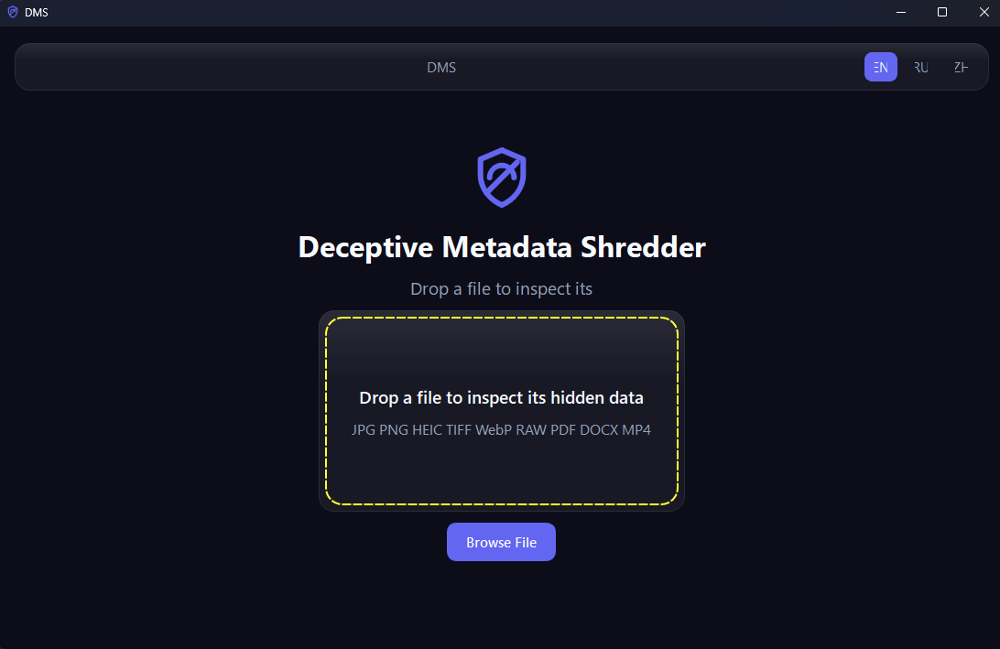
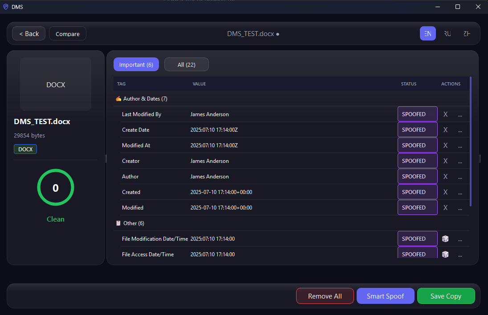

# Deceptive Metadata Shredder

<p align="center">
  
</p>

**Deceptive Metadata Shredder (DMS)** is a privacy-focused desktop tool that runs **entirely offline**. It helps you see what is hiding inside your files—GPS, device names, dates, authorship—and then **strip** that metadata or **replace** it with believable fake values, without having to trust a cloud service.

Use it for photos, PDFs, Office documents, and common video formats. The graphical app walks you through everything; the command line is there when you want to script or automate.

## Preview

<table>
  <tr>
    <td width="50%" align="center"><strong>Main Window</strong></td>
    <td width="50%" align="center"><strong>Clean & Spoof</strong></td>
  </tr>
  <tr>
    <td></td>
    <td></td>
  </tr>
</table>

---

## What you can do

- **Inspect** metadata across JPEG, PNG, HEIC, TIFF, WebP, RAW, PDF, DOCX, MP4, MOV, and more—with sensitive fields called out clearly.
- **Clean** files: write a new copy with metadata removed; the original file stays untouched unless you choose otherwise.
- **Spoof** metadata: smart GPS (stays inside the same country using offline map data), realistic device profiles from a bundled database, fake authors and shifted dates—again via a copy, not in-place edits by default.
- **Watch a folder** so new drops get processed automatically (optional output into a `dms_cleaned/` subfolder, with extra options for power users).
- **Batch** many paths or globs in one go.

Everything is designed so you stay in control: preview before you change things, confirm destructive steps, and keep originals safe.

---

## Install from source

You need **Python 3.11+**.

```powershell
python -m venv .venv
.venv\Scripts\Activate.ps1
pip install -r requirements.txt
pip install -e .
```

That installs two commands on your PATH:

| Command | What it is |
|--------|------------|
| `dms` | Command-line interface |
| `dms-gui` | Launches the graphical app |

You can also start the GUI with:

```powershell
python -m dms.interfaces.gui.app
```

### exiftool

DMS uses **exiftool** for the deepest metadata read/write support. Install it on your OS, or on Windows drop the portable binaries into `bin` when building from source (see below).

| Platform | What to do |
|----------|------------|
| Windows (official release `.exe`) | exiftool is bundled inside the executable—nothing to install |
| Windows (from source) | Put `exiftool.exe` and the `exiftool_files` folder in `bin` |
| macOS | `brew install exiftool` |
| Linux | `sudo apt install libimage-exiftool-perl` (or your distro’s package) |

If exiftool is missing, images and documents still get **limited** analysis via Pillow and built-in readers where possible.
`clean` also has fallback cleanup for JPG/PNG/PDF/DOCX, but coverage is format-limited compared with exiftool.
`spoof` requires exiftool for reliable write support.

---

## Command line (`dms`)

Run `dms --help` for a quick overview, or `dms <command> --help` for any subcommand.

### Quick examples

```powershell
dms analyze .\photo.jpg
dms analyze .\report.pdf --format json

dms clean .\photo.jpg
dms clean .\photo.jpg -o .\out\stripped.jpg --yes

dms spoof .\photo.jpg --gps smart --device apple_iphone_14_pro --author "Jane Doe"
dms spoof .\scan.pdf --gps remove --dates shift:-400 --yes

dms watch .\Downloads
dms watch .\Inbox --mode spoof --recursive
dms watch .\Drop --collect-subfolder
dms watch .\Drop --collect-subfolder --all

dms batch .\*.jpg --mode clean --yes
dms batch .\a.jpg .\b.png --output-dir .\out --mode spoof --yes
```

### Commands in plain language

| Command | Purpose |
|---------|---------|
| **`dms`** (no subcommand) | Shows the banner and a short command list |
| **`dms --version`** | Version, Python, and exiftool status |
| **`dms analyze <file>`** | List metadata; `--format` can be `table`, `json`, or `minimal`. Read-only. |
| **`dms clean <file>`** | Remove all metadata into a new file (`*_cleaned` by default). `-o` / `--output` sets the path. `--yes` skips the prompt. |
| **`dms spoof <file>`** | Smart or guided spoofing. `--gps`, `--device`, `--author`, `--dates`, `-o`, `--yes`, `--residual` (strip leftovers after spoof). Requires exiftool for full spoofing. |
| **`dms watch <folder>`** | Watch for **new** files only (nothing that was already there before you started). `--mode clean` or `spoof`. `--recursive` includes subfolders. `--collect-subfolder` writes results under `<folder>/dms_cleaned/` instead of next to each file. `--all` (only with `--collect-subfolder`) also processes names ending in `_cleaned` / `_spoofed` / `_dms`; files created inside `dms_cleaned/` are always ignored. Ctrl+C to stop. |
| **`dms batch <paths…>`** | Many files or globs in one run. `--mode clean` or `spoof`, optional `--output-dir`, `--yes`, `--residual` for spoof. Files with no sensitive metadata are skipped. |

Technical errors may be logged to **`dms_errors.log`** in the current working directory (or a temp path if that fails).

---

## Graphical app (`dms-gui`)

Launch **`dms-gui`** after install, or `python -m dms.interfaces.gui.app`. The UI offers drag-and-drop, inspection tables, compare views, batch flows, and spoof editors—same engine as the CLI, without typing commands.

---

## Windows portable executable and installer

From a dev checkout on **Windows**, after your venv is set up and dependencies installed:

```powershell
.\scripts\build.ps1
```

This runs PyInstaller and, if [Inno Setup 6](https://jrsoftware.org/isinfo.php) is installed, also builds an installer.

Typical outputs under **`dist/`**:

| Artifact | Description |
|----------|-------------|
| `DMS_Portable.exe` | Single portable GUI executable (exiftool bundled) |
| `DMS_Setup.exe` | Installer (only if Inno Setup was found) |

On **macOS** / **Linux**, use `scripts/build_exe.sh` (see script for details). The output binary is `dist/DMS` and expects a system exiftool.

**CI / releases:** GitHub Actions can build all platforms when you push a version tag matching `v*.*.*`.

---

## Tests

Install dev dependencies (includes `pytest`), then run the suite:

```powershell
pip install -r requirements-dev.txt
pip install -e .
python -m pytest
```

Alternatively: `pip install -e ".[dev]"` then `python -m pytest`.

---

## License

MIT
