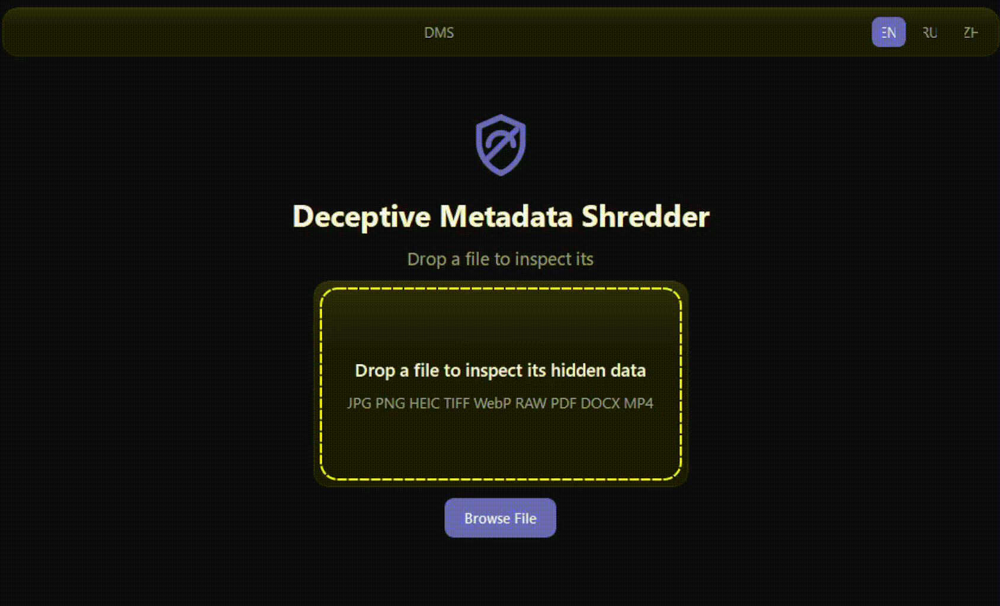
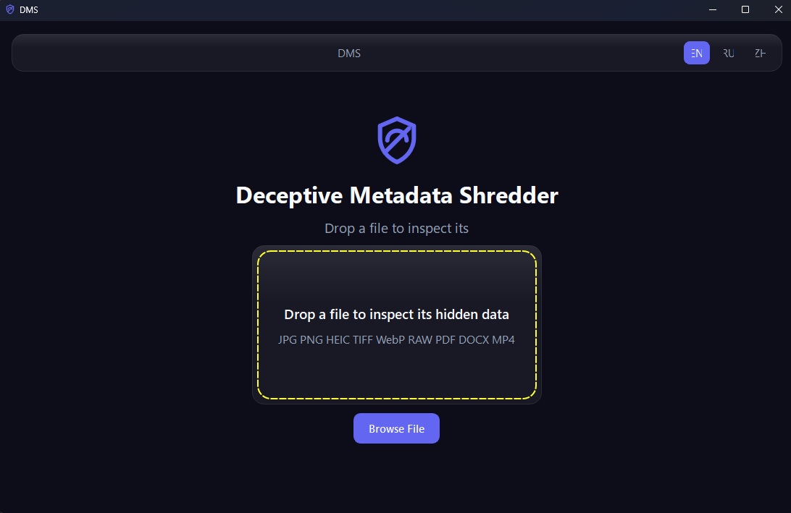
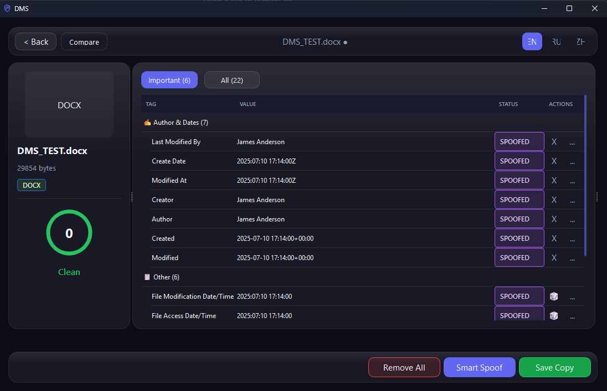

# DMS — Deceptive Metadata Shredder

<p align="center">
  
</p>

<p align="center">
  <strong>Offline metadata shredder that doesn't just wipe — it spoofs.</strong>
</p>

<p align="center">
  Remove or replace EXIF, GPS, device IDs, timestamps, and authorship in JPEG, PNG, HEIC, TIFF, RAW, PDF, DOCX, MP4, MOV — entirely on your machine.
</p>

<p align="center">
  <a href="https://github.com/davvikq/deceptive-metadata-shredder/releases"></a>
  <a href="LICENSE"></a>
  <a href="https://www.python.org/downloads/"></a>
  <a href="https://github.com/davvikq/deceptive-metadata-shredder/stargazers"></a>
  <a href="https://www.producthunt.com/products/dms-deceptive-metadata-shredder"></a>
</p>

<p align="center">
  <!-- TODO: replace with a real demo GIF (drag-and-drop → spoof → result) at assets/dms-demo.gif -->
  
</p>

---

## Why DMS

Most "metadata cleaners" have two problems:

1. **They send your file to a remote server.** That's the opposite of privacy.
2. **They wipe metadata completely.** An empty metadata block is itself a signal — recipients (and forensic tools) can tell something was hidden.

DMS solves both. It runs **entirely offline** with no network calls. And beyond wiping, it can **spoof** — replacing GPS coordinates with plausible nearby points, device IDs with realistic profiles from a bundled database, and timestamps with shifted but believable dates. Files look ordinary, but the real underlying data is gone.

---

## How DMS compares

| Feature                                    | DMS                          | ExifTool        | mat2          | ImageOptim   |
|--------------------------------------------|------------------------------|-----------------|---------------|--------------|
| Fully offline                              | ✅                            | ✅               | ✅             | ✅            |
| Metadata removal                           | ✅                            | ✅               | ✅             | ✅            |
| **Metadata spoofing** (plausible noise)    | ✅                            | ⚠️ scriptable   | ❌             | ❌            |
| Smart GPS spoofing (same region)           | ✅                            | ❌               | ❌             | ❌            |
| Realistic device-profile substitution      | ✅                            | ❌               | ❌             | ❌            |
| Watch folder automation                    | ✅                            | ❌               | ❌             | ⚠️            |
| Drag-and-drop GUI                          | ✅ PySide6                    | ❌ (CLI only)    | ⚠️ basic       | ✅ macOS only |
| CLI for scripting                          | ✅                            | ✅               | ✅             | ❌            |
| Cross-platform                             | Win / macOS / Linux          | all             | Linux / macOS | macOS         |
| Supported formats                          | JPEG, PNG, HEIC, TIFF, RAW, PDF, DOCX, MP4, MOV | very many | many | images |
| License                                    | MIT                          | Artistic        | LGPL-3.0      | GPL          |

If you want raw breadth, ExifTool is unbeatable. DMS sits **on top of ExifTool** for the heavy lifting and adds a GUI, smart spoofing, watch folders, and sensible defaults so non-experts don't shoot themselves in the foot.

---

## Who DMS is for

- **Journalists & their sources** — strip GPS and camera serial numbers from leaked photos before publication.
- **Activists & whistleblowers** — share evidence without leaking your device fingerprint or location.
- **Lawyers & legal teams** — sanitise client documents (PDF, DOCX) before disclosure.
- **Photographers** — control exactly what metadata reaches buyers and stock platforms.
- **OSINT researchers & red teams** — generate test files with controlled, plausible metadata.
- **Anyone uploading directly via messengers, email, or cloud storage** — these channels often leave full EXIF intact, unlike most social networks.

---

## Preview

<table>
  <tr>
    <td width="50%" align="center"><strong>Main Window</strong></td>
    <td width="50%" align="center"><strong>Clean & Spoof</strong></td>
  </tr>
  <tr>
    <td></td>
    <td></td>
  </tr>
</table>

---

## Install

That installs two commands on your PATH:

| Command   | What it is                  |
|-----------|-----------------------------|
| `dms`     | Command-line interface       |
| `dms-gui` | Launches the graphical app   |

### Windows portable executable

Download `DMS_Portable.exe` from the [latest release](https://github.com/davvikq/deceptive-metadata-shredder/releases). ExifTool is bundled — nothing else to install.

### From source

Requires **Python 3.11+**.

```bash
git clone https://github.com/davvikq/deceptive-metadata-shredder
cd deceptive-metadata-shredder
python -m venv .venv

# Windows
.venv\Scripts\Activate.ps1
# macOS / Linux
source .venv/bin/activate

pip install -r requirements.txt
pip install -e .
```

---

## ExifTool dependency

DMS uses **ExifTool** for the deepest metadata read/write support.

| Platform                          | What to do                                                              |
|-----------------------------------|-------------------------------------------------------------------------|
| Windows (official `.exe` release) | Already bundled — nothing to install                                    |
| Windows (from source)             | Place `exiftool.exe` and the `exiftool_files` folder in `bin/`          |
| macOS                             | `brew install exiftool`                                                 |
| Linux                             | `sudo apt install libimage-exiftool-perl` (or your distro's equivalent) |

Without ExifTool, DMS still does **limited** analysis via Pillow and built-in readers, and `clean` has fallback support for JPG / PNG / PDF / DOCX. `spoof` requires ExifTool for reliable write support.

---

## Command line

Run `dms --help` for an overview, or `dms <command> --help` for any subcommand.

### Quick examples

```bash
# Inspect what's in a file
dms analyze ./photo.jpg
dms analyze ./report.pdf --format json

# Wipe metadata into a new copy
dms clean ./photo.jpg
dms clean ./photo.jpg -o ./out/stripped.jpg --yes

# Spoof: replace metadata with plausible fake values
dms spoof ./photo.jpg --gps smart --device apple_iphone_14_pro --author "Jane Doe"
dms spoof ./scan.pdf  --gps remove --dates shift:-400 --yes

# Watch a folder for new files
dms watch ./Downloads
dms watch ./Inbox --mode spoof --recursive
dms watch ./Drop  --collect-subfolder
dms watch ./Drop  --collect-subfolder --all

# Batch-process many files at once
dms batch ./*.jpg --mode clean --yes
dms batch ./a.jpg ./b.png --output-dir ./out --mode spoof --yes
```

### Commands

| Command                | Purpose                                                                                           |
|------------------------|---------------------------------------------------------------------------------------------------|
| `dms`                  | Banner and short command list                                                                     |
| `dms --version`        | Version, Python, and ExifTool status                                                              |
| `dms analyze <file>`   | List metadata. `--format` is `table`, `json`, or `minimal`. Read-only.                            |
| `dms verify <file>`    | Report any sensitive metadata still present. Read-only; exits non-zero if the file is not clean.   |
| `dms clean <file>`     | Remove all metadata into a new file (`*_cleaned` by default). `-o` sets path. `--yes` skips prompt.|
| `dms spoof <file>`     | Smart or guided spoofing. Flags: `--gps`, `--device`, `--author`, `--dates`, `-o`, `--yes`, `--residual`. ExifTool required. |
| `dms watch <folder>`   | Watch for **new** files. `--mode clean\|spoof`, `--recursive`, `--collect-subfolder`, `--all`. Ctrl+C stops. |
| `dms batch <paths...>` | Many files or globs in one run. `--mode clean\|spoof`, `--output-dir`, `--yes`, `--residual`.       |

Errors are logged to `dms_errors.log` in the working directory (or a temp path if that fails).

---

## Graphical app

Launch with `dms-gui`, or `python -m dms.interfaces.gui.app`. The UI offers drag-and-drop, inspection tables, side-by-side compare views, batch flows, and spoof editors — same engine as the CLI, no commands required.

---

## Build your own portable binary

From a dev checkout on **Windows**:

```powershell
.\scripts\build.ps1
```

Runs PyInstaller and, if [Inno Setup 6](https://jrsoftware.org/isinfo.php) is installed, also builds an installer.

| Artifact           | Description                                                |
|--------------------|------------------------------------------------------------|
| `DMS_Portable.exe` | Single portable GUI executable (ExifTool bundled)          |
| `DMS_Setup.exe`    | Installer (only if Inno Setup was found)                   |

On **macOS** / **Linux** use `scripts/build_exe.sh`. The output binary is `dist/DMS` and expects a system ExifTool.

GitHub Actions builds for all platforms when you push a version tag matching `v*.*.*`.

---

## Tests

```bash
pip install -r requirements-dev.txt
pip install -e .
python -m pytest
```

Or `pip install -e ".[dev]"` then `python -m pytest`.

---

## FAQ

**What is metadata spoofing?**
Instead of just removing metadata, DMS replaces sensitive fields (GPS, device IDs, timestamps, author) with plausible-looking fake values. A wiped file can itself be a signal that something was hidden; a spoofed file looks ordinary.

**Why spoof instead of just remove?**
Empty metadata is sometimes more suspicious than realistic metadata. Spoofing maintains the natural look of a file while protecting the real underlying data.

**Is DMS truly offline?**
Yes. There are no network calls. GPS spoofing uses bundled Natural Earth GeoJSON data; device profiles ship inside the package.

**Does DMS modify my original files?**
No. DMS always writes a new copy (e.g. `photo_cleaned.jpg` or `photo_spoofed.jpg`) and leaves your original untouched.

**Which formats are supported?**
JPEG, PNG, HEIC, TIFF, WebP, RAW, PDF, DOCX, MP4, MOV, and others. ExifTool is recommended for full coverage; without it, DMS falls back to Pillow and built-in readers for JPG / PNG / PDF / DOCX.

**DMS vs ExifTool — when should I use which?**
ExifTool is a powerful Swiss-army-knife CLI with the broadest format support. DMS sits on top of ExifTool and adds a GUI, smart spoofing logic, watch folders, and safer defaults. For scripting niche workflows, use ExifTool directly. For a click-and-go privacy tool, use DMS.

**Is DMS free?**
Yes. MIT-licensed and fully open source.

**Does DMS work on macOS and Linux?**
Yes. Install via `pipx`/`pip` and `brew install exiftool` (macOS) or your distro's ExifTool package (Linux).

---

## License

[MIT](LICENSE) — use it, fork it, ship it. © 2026 Davvik.

---

<p align="center">
  <a href="https://www.producthunt.com/products/dms-deceptive-metadata-shredder">Product Hunt</a> ·
  <a href="https://github.com/davvikq/deceptive-metadata-shredder/releases">Releases</a> 
</p>
